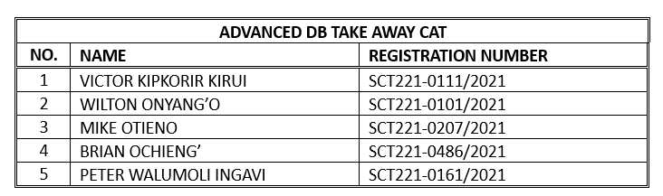
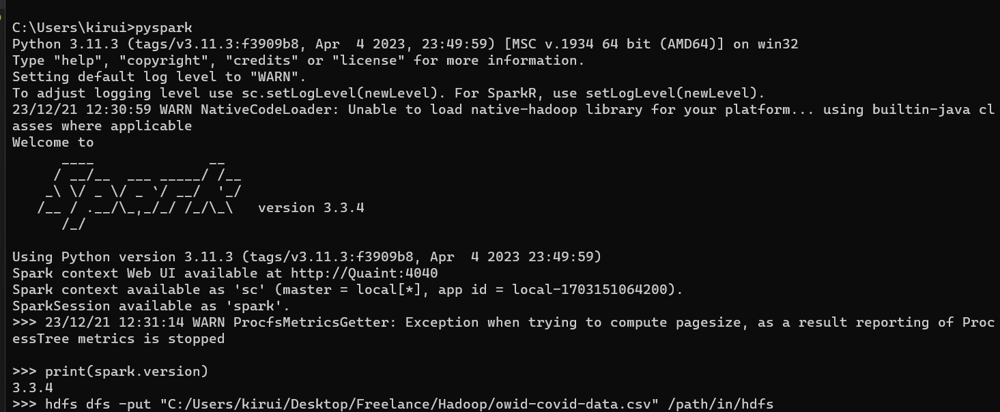
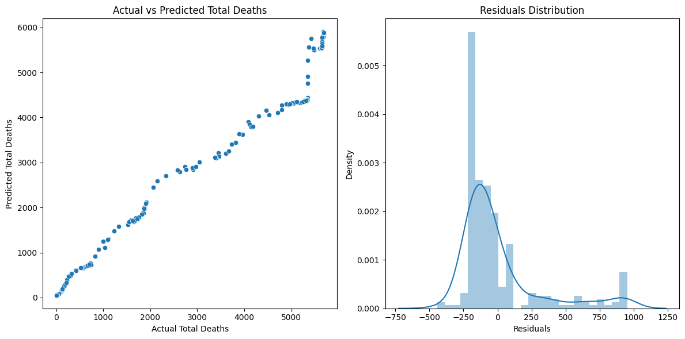
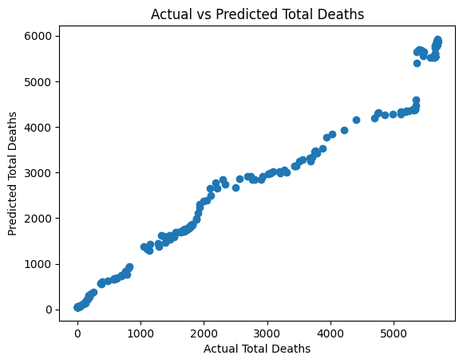
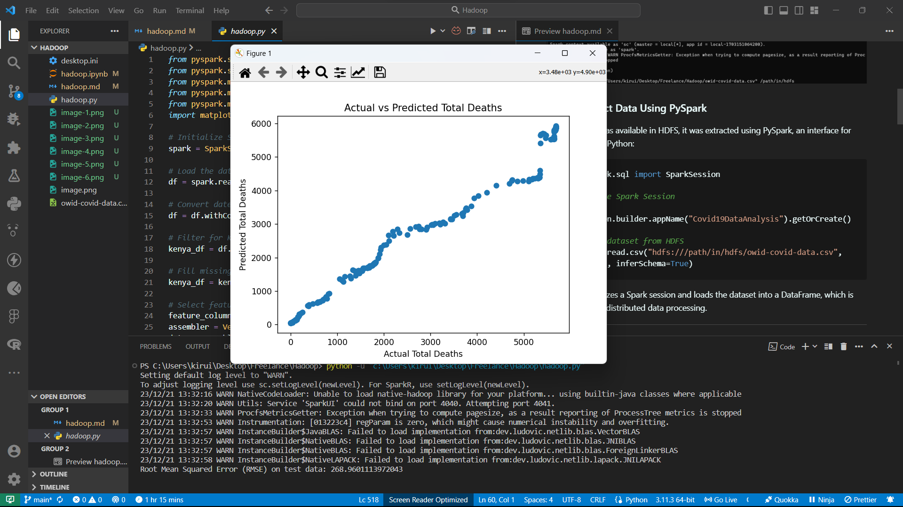

---

### Step 1: Ingest the Data into Hadoop DFS Data Lake
The dataset was ingested into the Hadoop Distributed File System (HDFS) to leverage its distributed storage capabilities. This process was accomplished using the Hadoop command-line interface with the following command:

```bash
hdfs dfs -put "C:/Users/kirui/Desktop/Freelance/Hadoop/owid-covid-data.csv" /path/in/hdfs
```

This command effectively transfers the local CSV file to the HDFS, ensuring that it is available for distributed processing across the Hadoop cluster.

---



### Step 2: Extract Data Using PySpark
Once the data was available in HDFS, it was extracted using PySpark, an interface for Apache Spark in Python:

```python
from pyspark.sql import SparkSession

# Initialize Spark Session
spark = SparkSession.builder.appName("Covid19DataAnalysis").getOrCreate()

# Load the dataset from HDFS
df = spark.read.csv("hdfs:///path/in/hdfs/owid-covid-data.csv", header=True, inferSchema=True)
```

This script initializes a Spark session and loads the dataset into a DataFrame, which is essential for the distributed data processing.

---

### Step 3: Pre-process the Extracted Data
The extracted data underwent several preprocessing steps in PySpark:

```python
from pyspark.sql.functions import to_date

# Convert date column to date format
df = df.withColumn('date', to_date(df['date'], 'yyyy-MM-dd'))

# Handling missing values
df = df.na.fill(0)  # or df.na.drop()

# Filter for specific data, e.g., Kenya
kenya_df = df.filter(df['location'] == 'Kenya')
```

The date column was converted to a proper date format, missing values were filled with zeros, and the dataset was filtered to include only data relevant to Kenya.

---

### Step 4: Predictive Analytics
A Linear Regression model was used for predictive analysis:

```python
from pyspark.ml.feature import VectorAssembler
from pyspark.ml.regression import LinearRegression

# Define features and label
assembler = VectorAssembler(inputCols=['total_cases', 'new_cases', 'population'], outputCol="features")
data = assembler.transform(kenya_df).select('features', 'total_deaths')

# Split data
train_data, test_data = data.randomSplit([0.8, 0.2], seed=42)

# Define and train the model
lr = LinearRegression(featuresCol='features', labelCol='total_deaths')
lr_model = lr.fit(train_data)
```

This section of the script focuses on selecting features, assembling them, splitting the dataset, and training the model on the training set.

---

### Step 5: Visualize the Model
The model's predictions were visualized using Matplotlib:

```python
import matplotlib.pyplot as plt

# Make predictions
predictions = lr_model.transform(test_data)

# Convert to Pandas DataFrame for visualization
pandas_df = predictions.select("total_deaths", "prediction").toPandas()

# Visualization
plt.scatter(pandas_df['total_deaths'], pandas_df['prediction'])
plt.xlabel('Actual Total Deaths')
plt.ylabel('Predicted Total Deaths')
plt.title('Actual vs Predicted Total Deaths')
plt.show()
```

The scatter plot illustrates the relationship between actual and predicted total deaths, providing a visual assessment of the model's performance.

---



### Step 6: Test the Model
The model's performance was evaluated using the Root Mean Squared Error (RMSE) metric:

```python
from pyspark.ml.evaluation import RegressionEvaluator

# Evaluate the model
evaluator = RegressionEvaluator(labelCol="total_deaths", predictionCol="prediction", metricName="rmse")
rmse = evaluator.evaluate(predictions)
print(f"Root Mean Squared Error (RMSE) on test data: {rmse}")
```

The RMSE value offers a quantitative measure of the model's accuracy, indicating how closely the predicted values match the actual death counts.

---


